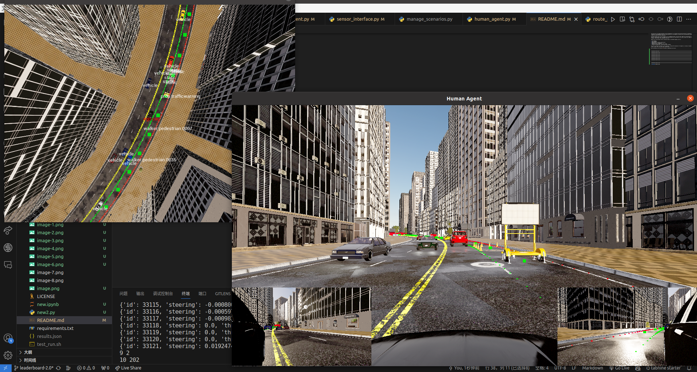
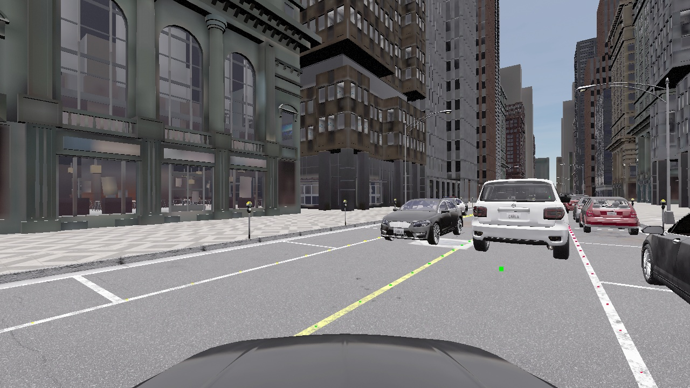
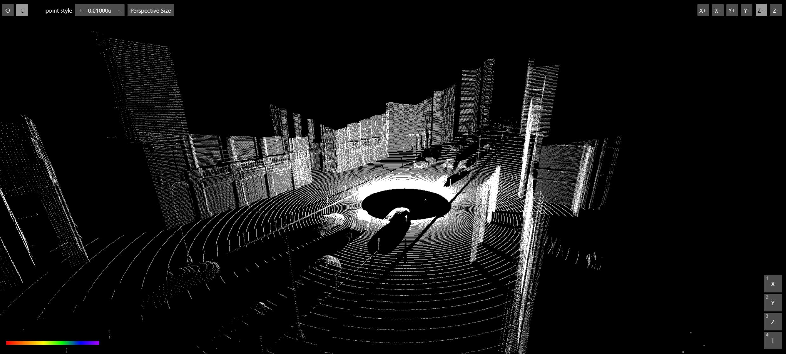

# CARLA DATASET GENERATOR
This project is a diversified simulation data system that uses CARLA to capture interactions between people, vehicles, and roads. You can train your autonomous driving algorithms with the generated data.

The simulation system collects multimodal environmental input data such as traffic light status, traffic signs, traffic participants, lane markings, and ground truth data related to the ego vehicle's driving behavior, including throttle, steering, braking, and gear. 

The simulation system offers customizable interfaces for parameters such as weather, towns, routes, and the ego vehicle's sensor configuration, enabling a wide range of simulation data customization.

The simulation system is implemented based on the CVPR 2024 CARLA Leaderboard 2.0 simulation framework.



## Usage

1. Install CARLA/leaderboard/scenario_runner according to the official website: https://leaderboard.carla.org/get_started/. Do not forget to setup the environment variables.

2. Remove the `leaderboard` folder in the CARLA installation directory and replace it with the current repository by running the following command:
```bash
cd <CARLA installation directory>
rm -rf leaderboard
git clone https://github.com/Daniel-ChenJH/carla_dataset_generator.git
mv carla_dataset_generator leaderboard
```

3. Install the required python packages.
```bash
conda activate carla
pip install -r py370_requirements.txt
```

4. Run the following command to start the simulation.
```bash
conda activate carla
cd <CARLA installation directory>
./CarlaUE4.sh -fps=20 -quality-level=Epic
cd leaderboard
python leaderboard/leaderboard_evaluator.py
```


## Customization
The following parameters can be customized:

- towns
- routes
- repetitions
- weather
- car model
- sensors configuration(kind, number, position, config value, etc.)
- traffic participants(vehicles, walkers, traffic lights, etc.)
- tags to be displayed
- human drive or autopilot
- whether to save the sensor data
- whether to save the ground truth data

## Data and Format
All the data will be saved in the `<CARLA installation directory>/leaderboard/record_data/runs{i}` folder. The data is saved in the following format:

- JPG: Images from the camera or segment_camera sensor. Folder: `Camera_Center`、`Camera_Left`、`Camera_Right`、`Segment_Camera`.

- PCD: Point cloud data from the lidar sensor. Folder: `LIDAR`.

- JSON: 
  - Data collected from RADAR/IMU/GNSS sensors. File: `RADAR`、`IMU`、`GNSS`.
  - Data of lanemarkings seen from ego car. File: `lanemarkings`.
  - All the Ground Truth data collected from the CARLA WORLD. File: `SPEEDOMETER`.


